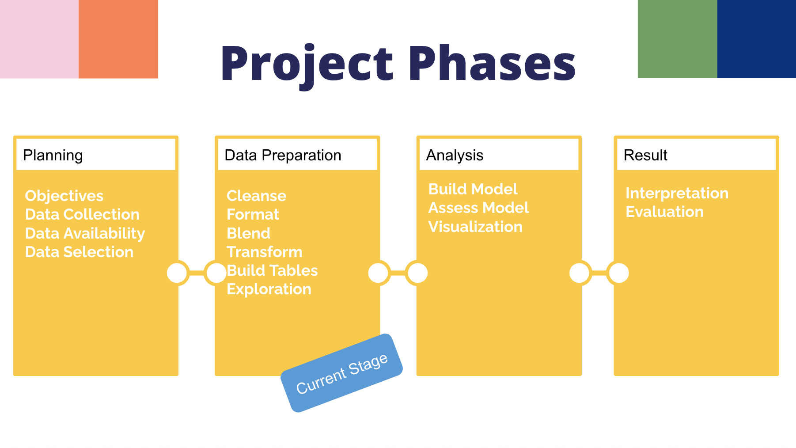
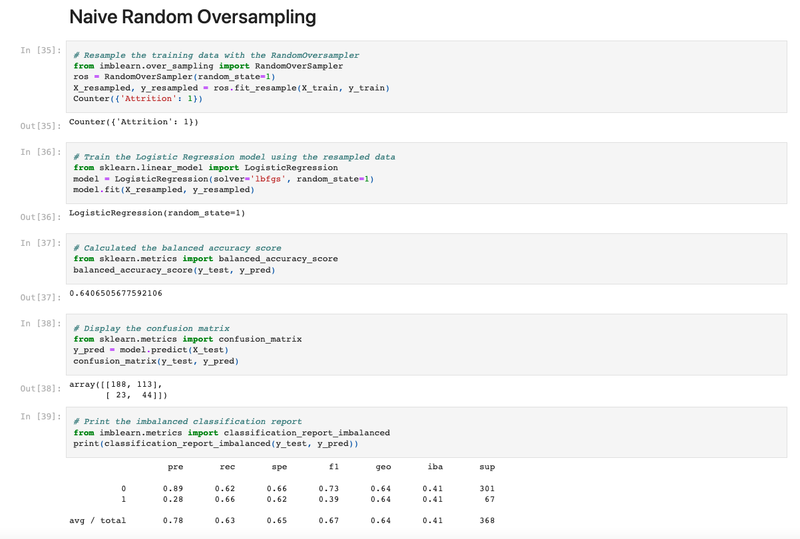
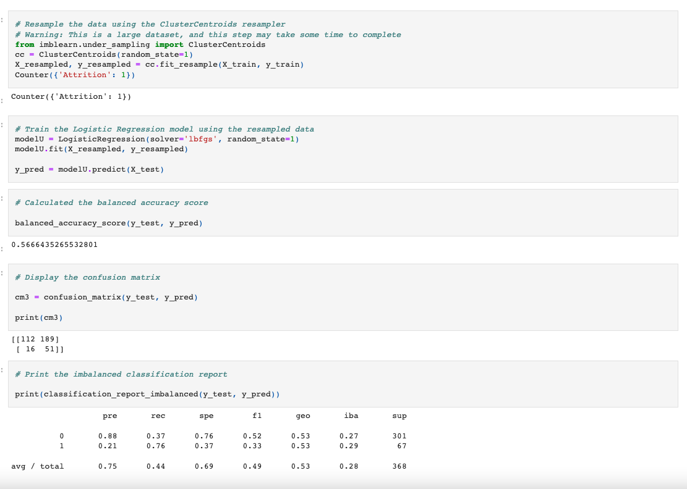

# Employee_Attrition

## Project overview

Employee retention is one of the most important factors that drives a company's competitive advantage. Conversly, employee attrition, particularly abnormal trends, impacts the company's bottom line.  As we know, attrition of employees cannot be avoided but there have several reasons for employee attrition. Our group will doing the data analysis using IBM HR Analytics Employee Attrition & Performance dataset to better help company understand and how to do on the interventions. It will be most effective in reducing unwanted attrition.
    
    
## Topic for project

Identify the factors that are driving employee attrition and using these insights to predict who are at risk of leaving the company.

## Reason We Chose This Topic
Attrition is very relevant and relatable to most of us because we've all had jobs that we've left - for various reasons.   Each company is its own ecosystem made up of intricate factors that then make up its unique culture.  For this particular project, we will examine what is driving IBM employees to leave, use the data to inform the areas the company need to assess and improve and also be able to accurately predict who are at risk of leaving based on the machine learning model we've created.

## Team Members:

- Sunny Wong (https://github.com/sunnycywong)

- Mei Ling Xue (https://github.com/mxx8813)

- Erich Engelhardt (https://github.com/Engelhardte)

- Sophia(xiaoshan) Zhou (https://github.com/JoJofia)

## Technology and Tools
Jupyter Notebook to support interactive data preprocessing
Pandas library for inspecting and cleaning the raw data
Sqlalchemy for connecting data to the ML model
Scikit-learn to build machine learning models
Tableau for analysing and visualizations
Google Slides for a presentation

## Project Details
### Communication protocols: 

The team will leverage various communication channels to facilitate the project.

We will spend a large portion of virtual class time to plan, discuss, delegate, and support one another on task assignments and spend the time working together virtually.

Outside of dedicated class time on Tuesday and Thursday, the team will utilize a private Slack channel while working async and communicate updates, questions, etc. 

If needed, the team will also be setting up dedicated meetings outside of class hours. 

### Preliminary data preprocessing:
  
The team has reviewed and discussed each data column in the raw file, which data columns should keep and drop for the model, and which data types would need to be transformed. 

Columns that were dropped are data that we anticipate are not the driving factors of the attrition and are therefore not necessary to include. For example, the employee count and over18 columns or departmentname.

 We will need to transfer certain data that are currently in string format into integer for machine learning purposes. For example, “attrition” is currently yes/no and will need to be converted to 0 and 1, gender (converting male and female to 0 and 1), and marital status (converting single, married, and divorced to 0, 1, and 2).

### Preliminary feature engineering and selection
The team will be using Postgres to feed data into our machine learning models. 

### In order to use the best model for the analysis, the team will be testing out all six models.
   - Logistic Regression 
   - Basic Neural Network
   - Support Vector Machine
   - Deep Learning Model
   - Random Forest 
   - Deep Learning Model

After the results are pulled, the team will utilize Tableau to visualize the findings and insights. 

### Data exploration phase
The team is in the progress of cleaning and extracting the data. The team will enter the data exploration phase after the data is ready to be reviewed. 

### Analysis phase
Given that the team is still working on cleaning and extracting data, we will begin the analysis once the data is ready to be ingested in the machine learning models. 

Below is an overview of the projet phases

### Model Choice
We decided to implement supervised machine learning using a logistic regression model. This is because the scenario we are studying involves multiple independent variables, but only has binary outcomes for the dependent variable: either the employee leaves the organization, or they do not. Within the data set, this is shown through the “Attrition” column’s possible values: yes or no. This value is not continuous, so we do not use a linear regression model. The model we developed will use the available data to put each new sample into one of two classes that each correspond to one of those two outcomes. One downside that we must keep in mind when using a logistic regression model is that it may be prone to overfitting caused by having many independent variables relative to the small size of the training set.

We lean away from undersampling, as the dataset we are using may not be large enough to facilitate cutting it even smaller. This makes oversampling more attractive, but we must also be wary of its inherent vulnerability to outliers causing inaccuracies in how it measures relationships between the dependent variable and the independent variables. Combination sampling would allow us to diminish the cons of using oversampling, although it also reintroduces the downsides of undersampling, which could be problematic due to the dataset’s small size. Therefore, we will likely test different sampling strategies to see how each performs in terms of accuracy and precision.

### Data resource:
   - Image: [link](https://lattice.com/library/what-is-employee-experience-vs-employee-engagement)  
   - Dataset: [link](https://www.kaggle.com/datasets/pavansubhasht/ibm-hr-analytics-attrition-dataset)

## Results - six different models
Before we start training a model, we have to partition our dataset into a training set and a test set.
### **Logistic Regression**

- In logistic Regression models has accuracy score about 64.07%, the recall in 62% on actual attrition and 66% in non-attrition.
For this models, there are 301 non-attrition for the actual attrition and 67 actual occurrences for actual attrition. And the precision for the actual attrition is low, indicating a large number of false positives, which indicates an unreliable positive classfication.
- The logistic regression model's accuracy is 64.7% and F1 Score are low is not good at classifying employee attrition.

### **Naive Random Oversampling**

### **SMOTE Oversampling**

### **Undersampling**

### **Combination(Over and Under Sampling)**
.png)

### **Balanced Random Forest Classifiter**

### **Easy Ensmeble AdaBoost Classifer**

## Summary
TBD

## Google Slides Link
[Click here](https://docs.google.com/presentation/d/1tK68lEqBwnXk-U9_hVBMxHCFWIiPoHWBg3Ww6Z6_EX8/edit#slide=id.g13cb71ee761_0_0) to review our presentation slides

## Tableau Dashboard
[Click here](https://public.tableau.com/views/EmployeeAttrition_16582829561380/ByGender?:language=en-US&:display_count=n&:origin=viz_share_link) to see the interactive dashboard in Tableau

## Recommendations for Employers
TBD
